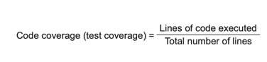
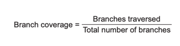
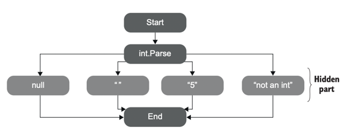

# chapter1. 단위 테스트의 목표

## **1.1 단위 테스트를 작성하는 이유**
  - 지속 가능한 성장을 할 수 있는 소프트웨어를 작성하기 위해
  - 코드에 대한 신뢰도 상승
  - 리펙토링에 효율 상승
 
 
## **1.2 좋은 테스트와 좋지 않은 테스트**
  - 잘못 작성한 테스트 코드는 작성하지 않는 것 보다 유지 보수가 나아질 수 있으나 거시적인 관점에서는 큰 차이가 없다
  - 프로젝트에 도움이 되는지 고려하지 않고 무작정 단위테스트를 늘리는 것은 유지 보수를 더욱 어렵게 한다
  - 코드는 자산이 아니라 책임이다, 코드가 더 많아 질 수록 버그에 노출되는 면적이 넓어질 뿐이다


## **1.3 테스트 커버리지**
테스트 커버리지는 부정 지표이지만 긍정의 지표가 될 수 없다, 커버리지가 낮으면 참고하여 테스트를 추가해야 할 수 있지만 테스트 커버리지가 높다는 것이 소프트웨어 품질을 보장하지 않는다

### 코드 커버리지
전체 코드에 대한 테스트 코드에서 실행되는 라인수의 비율
  <p align="center">
    
  </p>
     
> 아래 코드의 경우 if 문 내부의 라인이 실행되지 않음, 테스트에서 실행되는 라인 4줄 / 전체 코드 라인 5줄  =  80% 이다
  ```typescript
    function isStringLong(input: string) {
        if (input.length > 5) {
            return true // 테스트 코드에서 실행되지 않는 부분
        }
        return false
    }
  ```
  ```typescript
    it('test', () => {
        const result = isStrinLong('abc')
        expect(result).toBe(false)  
    })
  ```

### 분기 커버리지
if, switch 와 같은 제어문을 기준으로 전체 분기 경우 수에 대해 실행되는 분기의 비율
   
  <p align="center">
    
  </p>

> 아래 코드의 경우 테스트에서 실행하는 경우는 5보다 작은 케이스만 실행하므로 1/2 = 50% 이다 

  ```typescript
    function isStringLong(input: string) {
        return input.length > 5
    }
  ```
  ```typescript
    it('test', () => {
        const result = isStrinLong('abc')
        expect(result).toBe(false)  
    })
  ```

## 1.4 커버리지 지표에 문제점
  * 테스트 대상의 모든 결과를 검증했다 볼 수 없다( 실제로 테스트에서 아무런 검증을 하지 않는 경우가 있을 수 있다 )
  * 외부 라이브러리의 케이스를 고려한 커버리지 지표가 없다

  <p align="center">
    
  </p>


## 1.5 특정 커버리지 수치를 목표로 하기
* 특정 커버리지 숫자를 목표로 하는 것은 무의미하다, 특정 커버리지 수치를 목표로 할 경우 테스트에 집중할 수 없다
* 커버리지가 낮은 경우 문제 징후가 될 수 있다

## 1.6 성공적인 테스트의 특징
* 개발 주기에 통합되어 있다
* 코드베이스에서 중요한 비지니스 로직을 중점적으로 작성한다, 복작하고 중요한 알고리즘이 들어간 외부 서비스, 인프라 코드에 대해서도 작성한다
* 테스트의 가치가 테스트의 유지비를 상회한다( 가치있는 테스트를 식별하는 능력이 필요 )