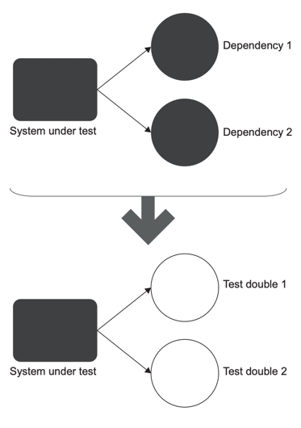

# chapter2. 단위 테스트란 무엇인가

## 2.1 단위 테스트의 정의
* 작은 코드 조각(단위)을 검증한다
* 빠르게 실행할 수 있다
* 테스트는 격리된 방식으로 실행한다
  * 테스트 격리 기준에 따라 고전파와 런던파로 나눌 수 있다

## 2.2 격리 문제에 대한 런던파 접근
* 테스트 대상 시스템(SystemUnderTest, SUT) 에 대한 의존성을 목업하는 방식으로 격리하는 방식으로 테스트를 구성한다 
* 의존성 분리를 통한 SUT에 대해서만 집중할 수 있다
* 복잡한 의존성이 있는 SUT에 대해서도 테스트가 가능하다

  

    
  
